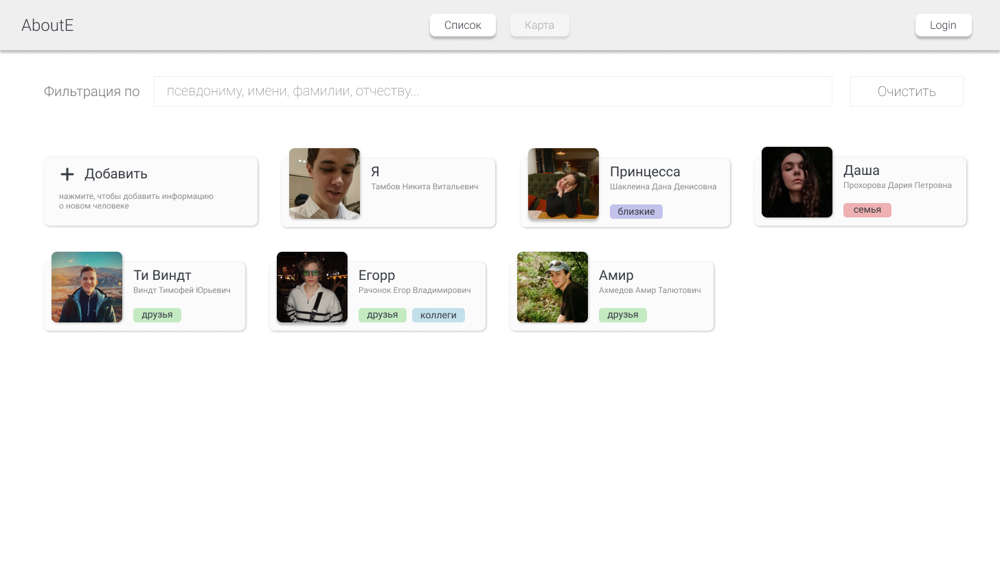
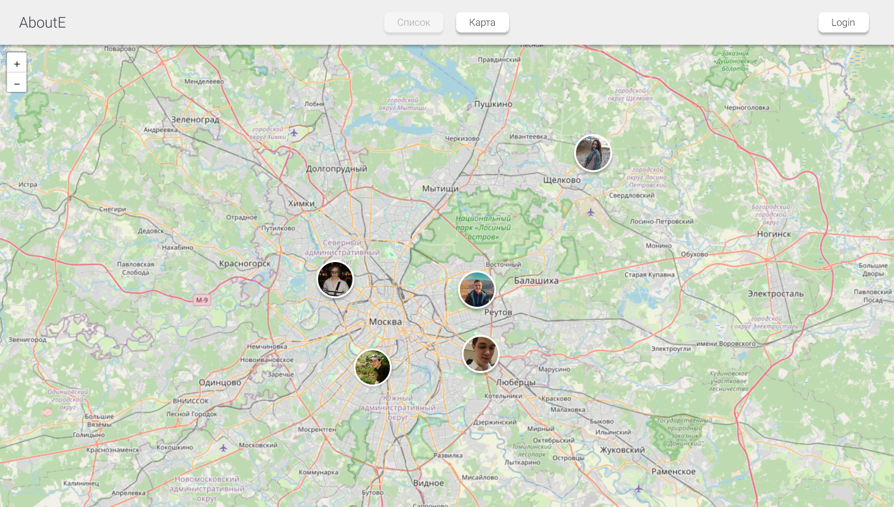
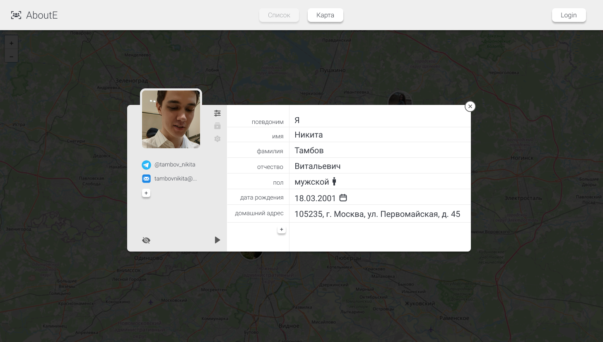
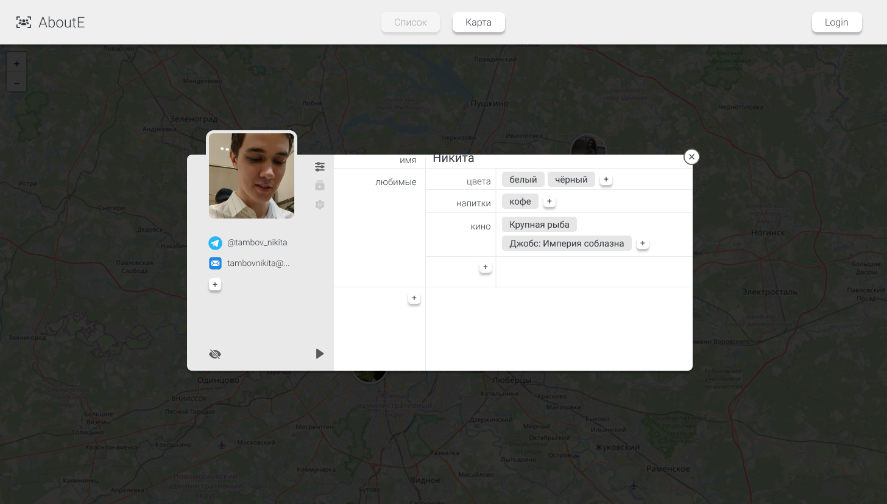
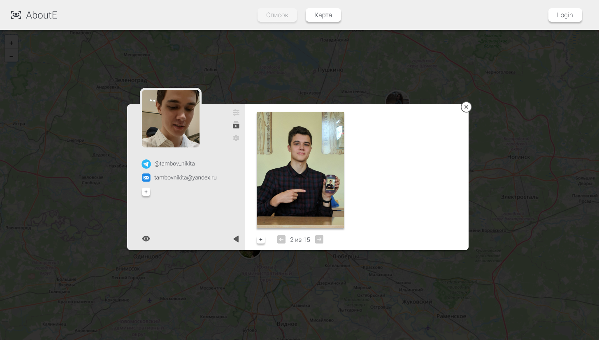
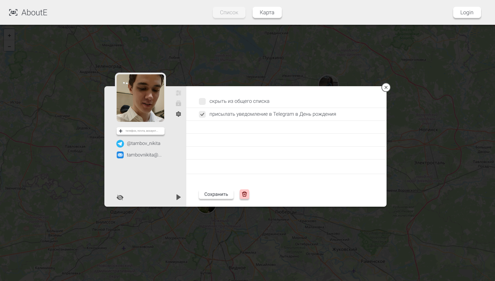

<h1>AboutE</h1>
https://aboute.online/  

  
A multifunctional service focused on working with information **about everyone**.  
<small>Многофункциональный сервис, ориентированный на работу с информацией обо всех.</small>

### Области применения

- Продвинутое досье на людей
- Хранилище фото/видео определённого человека
- Управление напоминаниями о важных датах
- Многофункциональная справочная/телефонная книга

### Реализация
<small>Некоторые страницы могут отличаться от итоговой реализации.</small>

<small>Главная страница</small>

<small>Страница, на которой можно посмотреть информацию о людях и добавить нового человека</small>

<small>Страница, на которой люди могут быть отображены относительно их географических характеристик (место проживания, место работы и т.п.)</small>

<small>При клике на карточку человека появляется окно с подробной информацией</small>

<small>Информацию можно редактировать, добавлять новую и сохранять</small>

    

    

<small>При необходимости можно добавить фото/видео, связанные с человеком</small>

<small>Предусмотрены гибкие настройки, включающие уведомления в Telegram</small>

### Технологии

- **React** - *все страницы и компоненты на стороне клиента*
- **FastAPI** - *обработка всех запросов с Frontend и Telegram-бота*
- **PostgreSQL** - *хранение всех данных о пользователях*
- **MongoDB** - *хранение характеристик и настроек всех persons*
- **TelegramAPI (aiogram)** - *бот-помощник, предоставляющий дополнительный функционал*
- **Nginx** - *гибкая конфигурация, работа с сертификатами, обработка статики*

